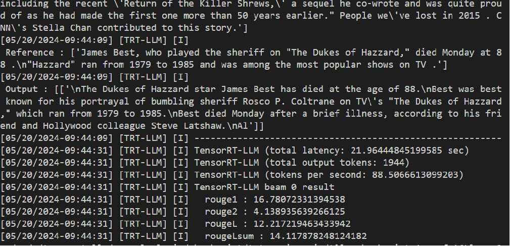

# Rebuttal

End-to-end text generation in TRT-LLM by MixQ 


## Building the TRT-LLM  MIXQ plugging  with 1 GPU for Llama-2-7B


Please Running the docker:

```
docker run --rm -it   --ipc=host  -v /home/code/:/code/tensorrt_llm  \
             -v /home/dataset/checkpoint:/dataset  -v /home/checkpoint:/code/checkpoint \
            --ulimit memlock=-1      --ulimit    stack=67108864             \
            --gpus=all    --env "CCACHE_DIR=/code/tensorrt_llm/cpp/.ccache"            \
             --env "CCACHE_BASEDIR=/code/tensorrt_llm"        
```


After starting the docker, set the env :

```
model=Llama-2-7b
ngpu=1
export model_dir=/code/tensorrt_llm/checkpoint/${model}
export quant_dir=/code/tensorrt_llm/checkpoint/checkpoinmix/tllm_checkpoint_${ngpu}gpu_fp16${model}
export out_dir=/code/tensorrt_llm/checkpoint/trt_enginesmix/tllm_checkpoint_${ngpu}gpu_fp16${model}
```

Please quantize the model by:

```
CUDA_VISIBLE_DEVICES=0    python  quantize.py --model_dir  ${model_dir} \
--output_dir  ${quant_dir}  --dtype float16 --device  cpu \
                               --qformat int8_mix  --calib_size 32 
```

Please build the MIXQ model by:

```
CUDA_VISIBLE_DEVICES=0 trtllm-build --checkpoint_dir ${quant_dir} \
   --output_dir ${out_dir} \
        --gemm_plugin float16 --mix_precision int8 
```


Generating the text with MIXQ by:

```
CUDA_VISIBLE_DEVICES=0  python  summarize.py --test_trt_llm \
                    --hf_model_dir ${model_dir} \
                    --data_type fp16 \
                    --engine_dir ${out_dir}
```


## Building the TRT-LLM  MIXQ plugging  with 4 stage pipline  for Llama-2-70B


```
model=Llama-2-70b
ngpu=4
export model_dir=/code/tensorrt_llm/checkpoint/${model}
export quant_dir=/code/tensorrt_llm/checkpoint/checkpoinmix/tllm_checkpoint_${ngpu}gpu_fp16${model}
export out_dir=/code/tensorrt_llm/checkpoint/trt_enginesmix/tllm_checkpoint_${ngpu}gpu_fp16${model}
```

Please quantize the model by:

```
 CUDA_VISIBLE_DEVICES=0,1,2,3   python  quantize.py --model_dir  ${model_dir} \
     --output_dir  ${quant_dir}  --dtype float16 --device  cpu \
    --qformat int8_mix  --calib_size 32 --pp_size ${gpu}
```

Please build the MIXQ model by:

```
CUDA_VISIBLE_DEVICES=0,1,2,3 trtllm-build --checkpoint_dir ${quant_dir} \
       --output_dir ${out_dir} \
           --gemm_plugin float16 --mix_precision int8 
```


Generating the text with MIXQ by:

```
CUDA_VISIBLE_DEVICES=0,1,2,3   mpirun -np 4 --allow-run-as-root    python  summarize.py --test_trt_llm \
                       --hf_model_dir ${model_dir} \
                       --data_type fp16 \
                       --engine_dir ${out_dir}
```


## Text generation result

# Llama-2-7B FP16 baseline


When running the ```summarize.py``` of MIXQ (Llama-2-7B in A100, 40GB, PCIE), we get:


