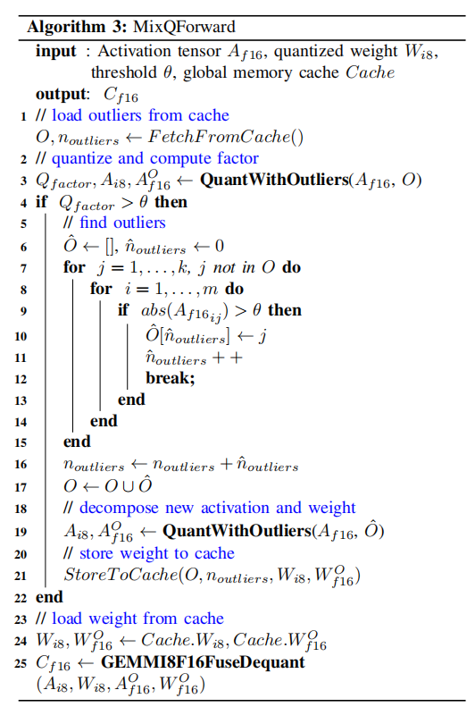
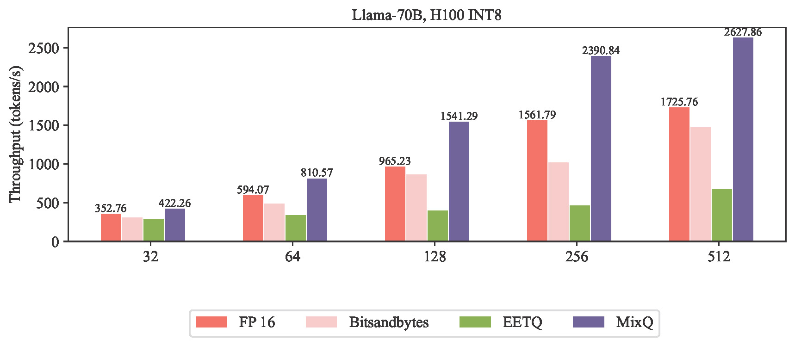

# Rebuttal


The repository supplements MIXQ with tested on H100, a list of revised errors, additional tests of QUIK, and end-to-end text generation in TRT-LLM using QUIK and MIXQ

# Revise grammatical and spelling errors (Table I)

| Location                  |  Errors         | Revised            |
| :---                     |    :----:   |        :----:       | 
| Abstract                   |   detection technique to fast verify the correctness    | detection technique to quickly verify the correctness      |
| Page  5, Fig. 8    |when outlier prediction fails and successes    | when outlier prediction fails and succeeds           | 
| Page 5, Fig. 8,               |    with Equation (2) and ...with  Equation (3)   | with Equation (3) and ... with  Equation (2)       | 
| Page 9, Sec. E, line 9               |  figure out in table  V  | figure out in table  IV  | 
| Page 9, Sec. E, line 16               |   The successive of keep accuracy |  The successive maintenance of accuracy  | 

### For Reviewer 1
 We below restated the formulas. The non-outliers are quantized as:
 
 $$ (A\_{INT8})\_{ij}=round\left(\frac{(A\_{FP16})\_{ij}}{(S\_{FP16})\_i}\right),j\notin\mathcal{O} $$

 
 
 
 The scaling factor is given by:
 
$$(S\_{FP16})\_i=\frac{ {\max}\limits\_{j\notin\mathcal{O}}|(A\_{FP16})\_{ij}|} {2^{bit-1}-1}$$
 
 The output is given by:
 
 $$\begin{align}C_{f16}\approx\sum_{j\in\mathcal{O}}{A_{FP16}^{j}W_{FP16}^{j}}+S^A_{FP16}S^W_{FP16}\cdot\sum_{j\notin\mathcal{O}}{A_{INT8}^{j}W_{INT8}^{j}}\end{align}$$
 
 
 There are no new-come outliers if 
 
 $$\begin{align} max(|A_{FP16}|)>\theta\end{align}$$
 
 which is equivalent to 
 
 $$\begin{align}max(|S_{FP16}|)>C\end{align}$$
 
 where
 
 $$\begin{align}C=\frac{\theta}{(2^{bit-1}-1)}\end{align}$$

### For Reviewer 2


For question (4), the following figures show the incorrect baseline:

 


the following figures show the correct baseline with 1.52x speedup:

 


For question (5), the TFLOPS of `down_proj (0.1% outliers)` is lower than `up_proj (1% outliers)` due to the different shapes of GEMM. For the `up_proj` GEMM the shape is `(bs, 11008, 4096)` and for the `down_proj`  the shape is `(bs, 4096, 11008)`. The latter is more hardware unfriendly and will results lower TFLOPS in A100. For example, for both INT8 GEMM without outliers, the TFLOPS of `up_proj` and `down_proj` is `332.7` and `278.4`, respectively. When running ```python For_reviewer_2_question_5.py``` in A100, we have:


``` TFLOPs of INT8 GEMM (up_proj  shape N=11008 K=4096):```
| Batch size                | 32          | 64            | 128         | 256      | 512      | 1024    | 2048    |
| :---                     |    :----:   |          ---: |  ---:        |  ---:    |  ---:    |  ---:   |  ---:   |
| TFLOPS                   | 52.438      | 98.844        | 165.232      | 241.607  | 332.709  | 384.142 | 414.819 |
| TFLOPS  (1% outliers)    | 28.733     | 68.909       | 135.880        | 234.251  | 304.176  | 351.690 | 375.310 |

``` TFLOPs of INT8 GEMM (down_proj shape N=4096 K=11008):```

| Batch size                  | 32          | 64           | 128         | 256      | 512      | 1024    | 2048    |
| :---                     |    :----:   |          ---: |  ---:        |  ---:    |  ---:    |  ---:   |  ---:   |
| TFLOPS                     | 48.007      | 93.591      | 141.468      | 213.711 | 278.463 | 347.504 | 399.033 |
| TFLOPS  (0.1% outliers)    | 23.793     | 67.470       | 115.640       | 208.781 | 255.095 | 305.948 | 351.168 |


### For Reviewer 3

-  We have implemented an end-to-end text generation in TRT-LLM by desigening trt-llm plugging. The code is shown in [MixQ-TRT-LLM-end-to-end](https://github.com/SC24RebuttalMIXQ/Rebuttal/tree/main/MixQ-trtllm-end-to-end)

- In the bitsandbytes, the forward operation  is very cost.
The MIXQ re-scheduals the workflow with the prediction algorithm by (from line 4-16)



-  We tested the MIXQ in H100




### For Reviewer 4


(1) The kernel designed by QUIK do not achieve the fused quantization, dequantization, and get NaN results when calling quik.symmetric.int4FusedDequantize.

If we run the following `.py` code, we get NaN result:

```
import random
import torch
import quik
def int8_fused_quik_test():
    M = 1024
    N = 5120
    K = 2048
    torch.manual_seed(1)

    a = torch.randint(-8, 8, (M, K), dtype=torch.int8).cuda()
    b = torch.randint(-8, 8, (N, K), dtype=torch.int8).cuda()

    scale_row = torch.rand(M, 1, dtype=torch.float16).cuda()
    scale_col = torch.rand(1, N, dtype=torch.float16).cuda()

    y = torch.rand(M, N).to(torch.float16).cuda()
    c = quik.symmetric.int8FusedDequantize(a, b, scale_row, scale_col, y)
    assert torch.all(~torch.isnan(c))
int8_fused_quik_test()
```
We will get ```AssertionError```


If we run the following `.py` code, we would not get NaN result:
```
import random
import torch
import mixlib
def int8_fused_mixlib_test():
    M = 1024
    N = 5120
    K = 2048
    torch.manual_seed(1)

    a = torch.randint(-8, 8, (M, K), dtype=torch.int8).cuda()
    b = torch.randint(-8, 8, (N, K), dtype=torch.int8).cuda()

    scale_row = torch.rand(M, 1, dtype=torch.float16).cuda()
    scale_col = torch.rand(1, N, dtype=torch.float16).cuda()

    y = torch.rand(M, N).to(torch.float16).cuda()
    c = mixlib.int8FusedDequantize(a, b, scale_row, scale_col, y)
    assert torch.all(~torch.isnan(c))
int8_fused_mixlib_test()
```


(2) We also implement QUIK and MIXQ in TRT-LLM for end-to-end text generation by TRT-plugging in 
[QUIK-TRT-LLM-end-to-end example](https://github.com/SC24RebuttalMIXQ/Rebuttal/blob/main/QUIK_TRT_LLM_plugging.cpp)
and [QUIK-TRT-LLM-end-to-end](https://github.com/SC24RebuttalMIXQ/Rebuttal/tree/main/MixQ-trtllm-end-to-end)


### For Reviewer 5

The Perplexity of block quant is computed by fake-quant:


|Llama Model      | 7B                        | 13B           | 65B           | 70B           |
| :---        |    :----:   |          ---: |  ---:        |  ---:    |  
| FP16           | 5.78                      | 5.11          | 3.54          | 3.43          |
| AWQ            | 5.94                      | 5.21          | 3.78          | 3.53          |
| SmoothQuant    | 5.85                      | 5.22          | 3.60          | 3.57          |
| Bitsandbytes   | 5.81                      | 5.14          | 3.58          | 3.49          |
| Atom (W4A4O16) | 6.16                      | 5.46          | 3.89          | -             |
| **BlockQuant**  (block size=32) | 5.79     | 5.14          | 3.59          | 3.72            |
| **QUIK (W4A4O16)** | 5.94                     | 5.15         |-          | 3.53       |
| MixQ (W8A8O16) | **5.79**            | **5.13**  | **3.58**  | **3.49**  |
| MixQ (W4A4O16) | 6.10                      | 5.40          | 3.87          | 3.73          |

