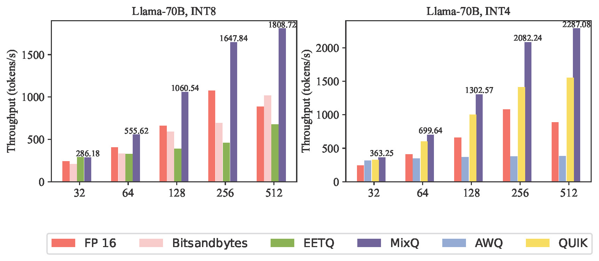
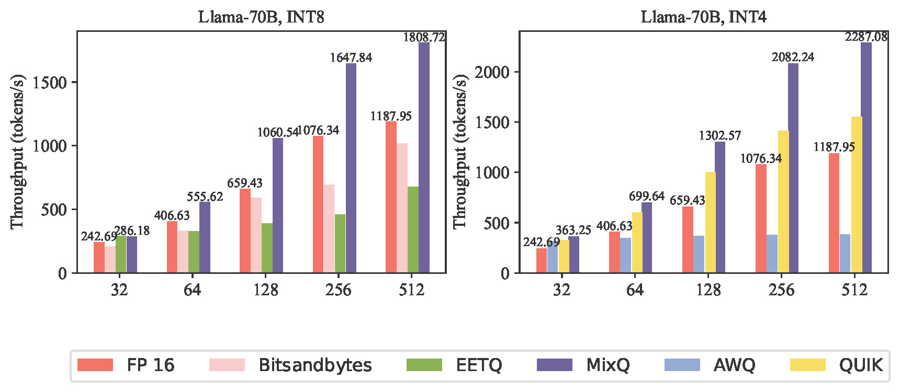

# Rebuttal
The repository supplements MIXQ with tested on H100, a list of revised errors, additional tests of QUIK, and end-to-end text generation in TRT-LLM using QUIK and MIXQ

# Revise grammatical and spelling errors (Table I)

| Location                  |  Errors         | Revised            |
| :---                     |    :----:   |        :----:       | 
| Abstract                   |   detection technique to fast verify the correctness    | detection technique to quickly verify the correctness      |
| Page  5, Fig. 8    |when outlier prediction fails and successes    | when outlier prediction fails and succeeds           | 
| Page 5, Fig. 8,               |    with Equation (2) and ...with  Equation (3)   | with Equation (3) and ... with  Equation (2)       | 
| Page 9, Sec. E, line 9               |  figure out in table  V  | figure out in table  IV  | 
| Page 9, Sec. E, line 16               |   The successive of keep accuracy |  The successive maintenance of accuracy  | 

### For Reviewer 5

For question (4), the following figures show the incorrect baseline:

 


the following figures show the correct baseline with 1.52x speedup:

 

For question (5), the TFLOPS of `down_proj (0.1% outliers)` is lower than `up_proj (1% outliers)` due to the different shapes of GEMM. For the `up_proj` GEMM the shape is `(bs, 11008, 4096)` and for the `down_proj`  the shape is `(bs, 4096, 11008)`. The latter is more hardware unfriendly and will results lower TFLOPS in A100. For example, for both INT8 GEMM without outliers, the TFLOPS of `up_proj` and `down_proj` is `332.7` and `278.4`, respectively. When running ```python For_reviewer_2_question_5.py``` in A100, we have:


``` TFLOPs of INT8 GEMM (up_proj  shape N=11008 K=4096):```
| Batch size                | 32          | 64            | 128         | 256      | 512      | 1024    | 2048    |
| :---                     |    :----:   |          ---: |  ---:        |  ---:    |  ---:    |  ---:   |  ---:   |
| TFLOPS                   | 52.438      | 98.844        | 165.232      | 241.607  | 332.709  | 384.142 | 414.819 |
| TFLOPS  (1% outliers)    | 28.733     | 68.909       | 135.880        | 234.251  | 304.176  | 351.690 | 375.310 |

``` TFLOPs of INT8 GEMM (down_proj shape N=4096 K=11008):```

| Batch size                  | 32          | 64           | 128         | 256      | 512      | 1024    | 2048    |
| :---                     |    :----:   |          ---: |  ---:        |  ---:    |  ---:    |  ---:   |  ---:   |
| TFLOPS                     | 48.007      | 93.591      | 141.468      | 213.711 | 278.463 | 347.504 | 399.033 |
| TFLOPS  (0.1% outliers)    | 23.793     | 67.470       | 115.640       | 208.781 | 255.095 | 305.948 | 351.168 |